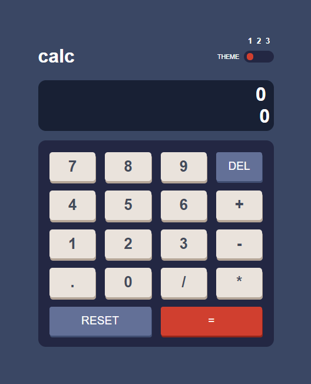

# Frontend Mentor - Calculator app solution

This is a solution to the [Calculator app challenge on Frontend Mentor](https://www.frontendmentor.io/challenges/calculator-app-9lteq5N29). Frontend Mentor challenges help you improve your coding skills by building realistic projects. 

## Table of contents

- [Overview](#overview)
  - [The challenge](#the-challenge)
  - [Screenshot](#screenshot)
  - [Links](#links)
- [My process](#my-process)
  - [Built with](#built-with)
  - [What I learned](#what-i-learned)
  - [Useful resources](#useful-resources)
- [Author](#author)
- [Acknowledgments](#acknowledgments)

## Overview

### The challenge

Users should be able to:

- See the size of the elements adjust based on their device's screen size.
- Perform mathmatical operations like addition, subtraction, multiplication, and division.
- Adjust the color theme based on their preference.

### Screenshot

### Links

- Solution URL: [Add solution URL here](https://www.frontendmentor.io/challenges/calculator-app-9lteq5N29/hub/calculator-app-mxEL6_sSB)
- Live Site URL: [Add live site URL here](https://calculator-app-mt.netlify.app/)

## My process

### Built with

- Semantic HTML5 markup
- CSS custom properties
- Flexbox
- CSS Grid

### What I learned

Use object oriented principles to build the functionailty of the app.
Learned how to change the href attribute of Link element in js to toggle theme.
Learned how to create a toggle element.

## Author

- Website - [Mondara](https://mondarathotage.com/)
- Linkedin - [@Mondara](https://www.linkedin.com/in/mondara-thotage/)
- Github - [@Mondara](https://github.com/Mondara)

